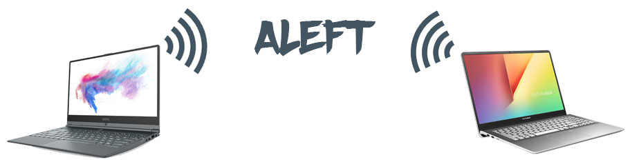

**ALEFT** stands for **A**lexandre & **Le**v (that's us) **F**ile **T**ransfer (that's what our programs do).

These are two simple C programs, one is a receiver and the other one is a sender. The sender can send a file to the receiver via TCP/IP, using C sockets. That's it.

**Dependencies**

You don't have to install anything fancy. Only basic Unix libs are used.

**Installation**

We made you a Makefile. Just type `make` at the root of the folder in your terminal and two executables will be created : *sender* and *receiver*.

**Usage**

* To execute the receiver, type
`./receiver -p [PORT]`
where [PORT] is the port number you want to use on your computer to allow the *sender* to send you files through it.

* To execute the sender, type
`./sender -p [PORT] -a [IP ADDRESS] -i [FILE]`
where [PORT] is the port number you want to connect to, [IP ADDRESS] is the IPv4 address of the receiver and [FILE] is the path to the file you want to send.

For example, if you want to try it on your computer, you can type :

`./receiver -p 11037`

`./sender -p 11037 -a 127.0.0.1 -i myfile.txt`

Don't forget that if you want to send a file to a computer across the Internet, they must open the chosen port on their "router".

**About us**

We are two CS students and we made this small project for fun because we think that C sockets are very interesting to play with.
Feel free to reuse our code or to do anything you want with it.
